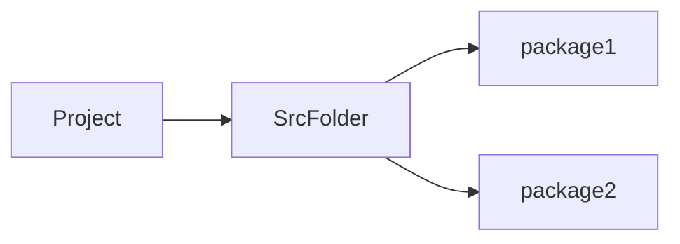
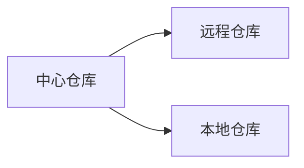

# 第二章 数据库基础及操作
[TOC]
# JDBC

## Definition
Q: What is JDBC?
A: Java DataBase Connectivity, an API to modify the database via Java

## Priority
- 各数据商使用相同接口
- 可用于不同数据库
- 更换数据库只需替换相应的数据库驱动
eg.导入MySQL数据库驱动包来使用MySQL数据库

## ShortComing
- 数据库连接信息硬编码
- SQL语句硬编码
- 操作繁琐、手动封装查询结果

## Work Flow
1. Java Language Coding
2. Sending SQL Code to MySQL
3. Exagerating SQL Code
4. Return the result to Java

## Usage
1. Creating a project, import the driver jar package
2. Registry the driver
3. Connect to MySQL
4. Define SQL Code
5. Get SQL object: `Statement`
6. Exagerate Code
7. Show the result
8. Release the resources

# JDBC API
## Basic API List
- DriverManager
- Statement
- ResultSet
- PreparedStatement

## DriverManager


## PreparedStatement使用
# 数据库连接池

# 练习：商品品牌数据增删改查
## Tasks
- [ ] 增加品牌
- [ ] 修改比亚迪Slogan
- [ ] 删除三只松鼠和小米

## Project Structures

## General Coding Flow
1. 设置属性
2. 生成Getter&Setter: <kbd>Alt</kbd> + <kbd>Enter</kbd>
### Create the entity class: Brand

### SelectALL Function
1. Load Config File
   - druid找不到路径: 打印出来
   ``` Java
   System.out.println(System.getProperty("user.dir"));
   ```
2. SQL Code
3. Handle with the result `List<Brand>`
   ```Java {.line-numbers}
    while (rs.next()) {
    String column1 = rs.getString("column1"); // 替换为你的列名
    int column2 = rs.getInt("column2"); // 替换为你的列名
    // 你可以继续获取更多的列...
    }
   ```s

### SelectById
1. 创建`BrandSelectById`类，根据id查询
2. Load Config File..(Same as the SelectALL)
3. SQL Code
   1. Set id property
4. Handle with the result `List<Brand>`

# MAVEN

## What's MAVEN?
管理和构建Java项目的工具。
- 提供标准化项目结构
- 提供标准化构建流程（编译、测试、打包、发布）
- 提供依赖管理机制

## Maven 项目结构
...

## Maven 项目构建流程
MAVEN 右键菜单 'Run MAVEN' 的各个按钮就是构建的各个流程

## MAVEN 依赖管理
示例：
```Java
<dependencies>
   <!-- MySQL Connector/J -->
   <dependency>
      <groupId>mysql</groupId>
      <artifactId>mysql-connector-java</artifactId>
      <version>8.0.26</version>
   </dependency>
   
   <!-- Apache Commons Lang -->
   <dependency>
      <groupId>org.apache.commons</groupId>
      <artifactId>commons-lang3</artifactId>
      <version>3.12.0</version>
   </dependency>

</dependencies>
```



## MAVEN 使用流程

下载地址：[Maven](https://maven.apache.org/)

### 配置本地仓库
`~/conf/setting.xml`：
```
<localRepository>Path/to/your/Repo</localRepository>
```

### 配置镜像仓库
`~/conf/settings.xml`
```
<mirror>
   <id>
   <name>
   <url>
   <mirrorOf>
<mirror>
```

## IDEA 使用 MAVEN
1. 建立

# Mybatis: Better than JDBC
## 实验3问题
- 增加数据操作，未报错，但数据未成功添加
  增删改手动提交事务
  ```java
  sqlSession.commit();
  ```
- 数据库连接异常
   检查MyBatis-Config.xml的连接信息，使用自己的数据库、用户名和密码

## 按照id查询

