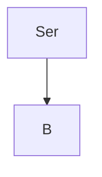
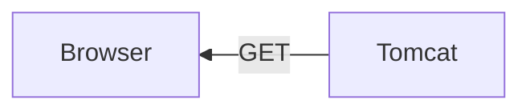
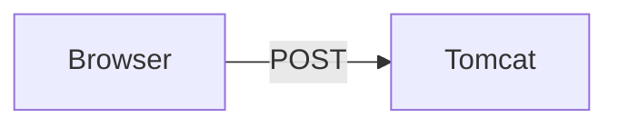
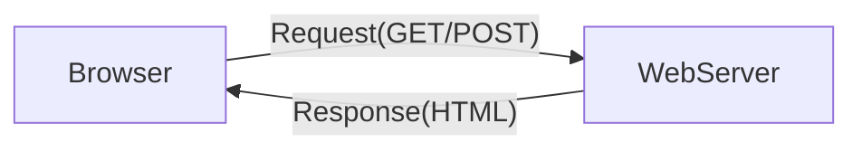
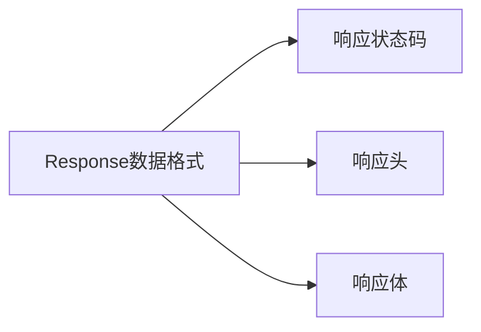

# C4.1 Apache Tomcat
下载地址：tomcat.apache.org
## Definition
Tomcat是一种Web服务器，类似Nginx

## 插件 Plugins
在IDEA的Maven项目的pom.xml中`<build>`字节中添加`plugins-plugin`
``` xml
<!-- 在pom.xml中添加tomcat插件 -->
<build>
    <plugins>
        <plugin>
            <groupId>org.apache.tomcat.maven</groupId>
            <artifactId>tomcat7-maven-plugin</artifactId>
            <version>2.2</version>
        </plugin>
    </plugins>
</build>
```

## 部署 Deploy
在IDEA中右键项目——Run，IDEA会自动部署。

# C4.2 Servlet

## Definition
- JavaWeb的核心内容，Java提供的动态Web开发技术
- 动态资源：不同用户看到的内容不同
- Servlet是Java定义规范，是一个接口，开发者需要实现接口库，并且需要在Web服务器运行，例如上文学习的Tomcat

## Crash Course
1. 创建Web项目
2. 在pom中添加Servlet依赖
    ``` xml
    <!-- 在pom.xml中添加Servlet依赖 -->
    <dependencies>
        <dependency>
            <groupId>javax.servlet</groupId>
            <artifactId>javax.servlet-api</artifactId>
            <version>4.0.1</version>
            <scope>provided</scope>
        </dependency>
    </dependencies>
    ```
3. 定义ServletFirstEye类，实现Servlet接口 `implements`
    ```Java
    @Override
    public void service(ServletRequest servletRequest, ServletResponse servletResponse) throws ServletException, IOException {
        // 处理请求并生成响应的代码
        System.Out.println("hello world");
    }
    ```
4. 配置访问路径 
在FirstEye类中声明`@WebServlet("/firstEye")`
## Servlet生命周期
   1. 加载和实例化
   2. 初始化
   3. 请求处理
   4. 终结服务器
## Servlet体系结构


## 自定义Servlet `extends HttpServlet`
### doGet
浏览器客户端向服务器请求数据，（拿到数据：Get）
直接访问网页就可以发送GET请求

### doPost
浏览器客户端向服务器提交数据，（发布数据：Post）
可以发送表单测试。


## Servlet总结
在Web服务器上，处理浏览器请求和处理网页的生命周期事件的一个接口。

# C4.3 Request & Response
## Web构成
Web Page
JavaWeb Program 
Database

## 概念 Definition
浏览器发送请求就是Request
Web服务器解析请求，存入Request对象
后台将相应数据封装到Response
Web服务器解析对象，按格式拼接结果
浏览器展示解析结果


## Request
### 从Request获取请求数据的方法
### 获取Header
1. 获取请求方法
2. 获取项目访问路径
3. 获取URL
4. 获取URI
5. 获取请求参数
6. 获取请求头
### 获通用获取方式
``` Java
request.getParameter();
```

### Request 请求转发
在服务器内，可以使用方法`request.getRequestDispather(destination).forward(request data);`来转发Requset到不同的资源并进行处理，最后返回到浏览器

## Response
### Response对象


### 输出字节流
```Java
// 输出字节流示例代码
OutputStream outputStream = response.getOutputStream();
String message = "Hello, world!";
outputStream.write(message.getBytes());
outputStream.flush();
outputStream.close();
```