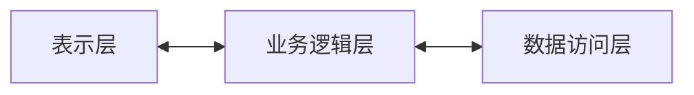

# C5_MVC
# 什么是MVC?
| |全称|作用|举例|
--|:--:|--|--|
M|Model|负责处理应用程序的数据和业务逻辑|Java Bean
V|View|负责用户界面的显示|HTML、Ajax
C|Controller|负责处理用户输入，更新模型和调整视图|Servlet

# MVVM？
Vue的核心思想，模型视图双向**绑定**

# 三层框架？
| |全称|作用|举例|
--|:--:|--|--|
表示层|web/controller|接受请求，调用业务逻辑层响应数据|JSP, Servlet
业务逻辑层|service|封装业务逻辑，组合数据访问层功能|Servlet
数据访问层|dao/mapper|对数据库基本操作|Mybatis



#POJO、DAO？
POJO(Plain Ordinary Java Object)，表示简单Java对象，不强制继承特定的类或实现特定的接口，也不依赖于特定的框架。这样的对象更加纯粹、简单，易于理解和维护。

DAO(Data Access Object)，数据接入对象，用于处理程序数据存放和读取。DAO层也叫Mapper层。
# 本章学到的框架、库
## Ajax
## axios
## Fastjson
用于JSON和Java对象之间的快速转化

```xml
    <!-- pom.xml -->
    <!--    添加FastJSON坐标-->
    <dependency>
      <groupId>com.alibaba</groupId>
      <artifactId>fastjson</artifactId>
      <version>1.2.83</version>
    </dependency>
```
## Vue
优化原生JS代码中DOM的操作，前端开发框架。

# 小技巧
1. IDEA快速生成变量
   1. '.var'之后回车
   2. 'ALT+ENTER'创建局部变量
   3. 'Ctrl+Alt+V'


